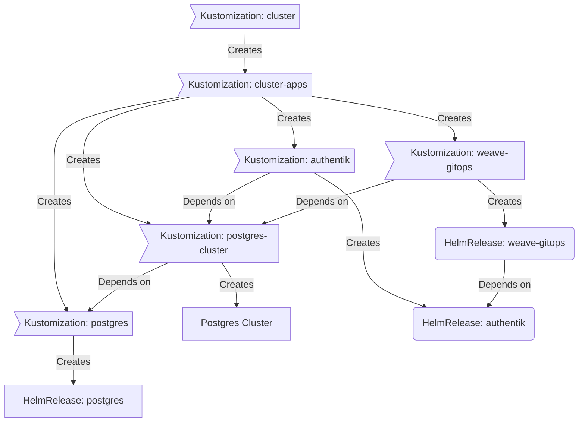

<div align="center">


### My Homelab Repository :snowflake:

_... automated via [Flux](https://fluxcd.io), [Renovate](https://github.com/renovatebot/renovate) and [GitHub Actions](https://github.com/features/actions)_ 🤖

</div>

<div align="center">

[](https://discord.gg/home-operations)&nbsp;&nbsp;
[](https://k3s.io/)&nbsp;&nbsp;
[](https://github.com/LilDrunkenSmurf/LilDrunkenSmurf/actions/workflows/scheduled-renovate.yaml)

</div>

<div align="center">

[](https://status.jory.dev)&nbsp;&nbsp;
[](https://status.jory.dev/endpoints/external_gatus)&nbsp;&nbsp;
[](https://status.jory.dev/endpoints/external_plex)

</div>

<div align="center">

[](https://github.com/kashalls/kromgo/)&nbsp;&nbsp;
[](https://github.com/kashalls/kromgo/)&nbsp;&nbsp;
[](https://github.com/kashalls/kromgo/)&nbsp;&nbsp;
[](https://github.com/kashalls/kromgo/)&nbsp;&nbsp;
[](https://github.com/kashalls/kromgo/)&nbsp;&nbsp;
[](https://github.com/kashalls/kromgo/)&nbsp;&nbsp;
[](https://github.com/kashalls/kromgo/)

</div>

---

## Overview

This is a monorepository is for my home k3s clusters.
I try to adhere to Infrastructure as Code (IaC) and GitOps practices using tools like [Ansible](https://www.ansible.com/), [Terraform](https://www.terraform.io/), [Kubernetes](https://kubernetes.io/), [Flux](https://github.com/fluxcd/flux2), [Renovate](https://github.com/renovatebot/renovate), and [GitHub Actions](https://github.com/features/actions).

The purpose here is to learn k8s, while practicing Gitops.

---

## ⛵ Kubernetes

There is a template over at [onedr0p/flux-cluster-template](https://github.com/onedr0p/flux-cluster-template) if you want to try and follow along with some of the practices I use here.

### Installation

My cluster is [k3s](https://k3s.io/) provisioned overtop bare-metal Debian using the [Ansible](https://www.ansible.com/) galaxy role [ansible-role-k3s](https://github.com/PyratLabs/ansible-role-k3s). This is a semi-hyper-converged cluster, workloads and block storage are sharing the same available resources on my nodes while I have a separate NAS server with ZFS for NFS/SMB shares, bulk file storage and backups.

### Core Components

- [actions-runner-controller](https://github.com/actions/actions-runner-controller): self-hosted Github runners
- [cilium](https://github.com/cilium/cilium): internal Kubernetes networking plugin
- [cert-manager](https://cert-manager.io/docs/): creates SSL certificates for services in my cluster
- [external-dns](https://github.com/kubernetes-sigs/external-dns): automatically syncs DNS records from my cluster ingresses to a DNS provider
- [external-secrets](https://github.com/external-secrets/external-secrets/): managed Kubernetes secrets using [Bitwarden](https://bitwarden.com/).
- [ingress-nginx](https://github.com/kubernetes/ingress-nginx/): ingress controller for Kubernetes using NGINX as a reverse proxy and load balancer
- [longhorn](https://longhorn.io/): Cloud native distributed block storage for Kubernetes
- [rook-ceph](https://rook.io/): Cloud native distributed block storage for Kubernetes
- [sops](https://toolkit.fluxcd.io/guides/mozilla-sops/): managed secrets for Kubernetes, Ansible, and Terraform which are committed to Git
- [spegel](https://github.com/XenitAB/spegel): stateless cluster local OCI registry mirror
- [tf-controller](https://github.com/weaveworks/tf-controller): additional Flux component used to run Terraform from within a Kubernetes cluster.
- [volsync](https://github.com/backube/volsync): backup and recovery of persistent volume claims

### GitOps

[Flux](https://github.com/fluxcd/flux2) watches the clusters in my [kubernetes](./kubernetes/) folder (see Directories below) and makes the changes to my clusters based on the state of my Git repository.

The way Flux works for me here is it will recursively search the `kubernetes/${cluster}/apps` folder until it finds the most top level `kustomization.yaml` per directory and then apply all the resources listed in it. That aforementioned `kustomization.yaml` will generally only have a namespace resource and one or many Flux kustomizations. Those Flux kustomizations will generally have a `HelmRelease` or other resources related to the application underneath it which will be applied.

[Renovate](https://github.com/renovatebot/renovate) watches my **entire** repository looking for dependency updates, when they are found a PR is automatically created. When some PRs are merged Flux applies the changes to my cluster.

### Directories

This Git repository contains the following directories under [Kubernetes](./kubernetes/).

```sh
📁 kubernetes
├── 📁 pi                 # pi cluster
│   ├── 📁 apps           # applications
│   ├── 📁 bootstrap      # bootstrap procedures
│   ├── 📁 flux           # core flux configuration
│   └── 📁 templates      # re-useable components
└── 📁 teyvat             # teyvat cluster
    ├── 📁 apps           # applications
    ├── 📁 bootstrap      # bootstrap procedures
    ├── 📁 flux           # core flux configuration
    └── 📁 templates      # re-useable components
```

### Flux Workflow

This is a high-level look how Flux deploys my applications with dependencies. Below there are 3 apps `postgres`, `authentik` and `weave-gitops`. `postgres` is the first app that needs to be running and healthy before `authentik` and `weave-gitops`. Once `postgres` is healthy `authentik` will be deployed and after that is healthy `weave-gitops` will be deployed.



---

## ☁️ Cloud Dependencies

While most of my infrastructure and workloads are self-hosted I do rely upon the cloud for certain key parts of my setup. This saves me from having to worry about two things. (1) Dealing with chicken/egg scenarios and (2) services I critically need whether my cluster is online or not.

The alternative solution to these two problems would be to host a Kubernetes cluster in the cloud and deploy applications like [HCVault](https://www.vaultproject.io/), [Vaultwarden](https://github.com/dani-garcia/vaultwarden), [ntfy](https://ntfy.sh/), and [Gatus](https://gatus.io/). However, maintaining another cluster and monitoring another group of workloads is a lot more time and effort than I am willing to put in.

| Service                                         | Use                                                               | Cost           |
|-------------------------------------------------|-------------------------------------------------------------------|----------------|
| [Bitwarden](https://bitwarden.com/)             | Secrets with [External Secrets](https://external-secrets.io/)     | ~$10/yr        |
| [Cloudflare](https://www.cloudflare.com/)       | Domain and S3                                                     | ~$30/yr        |
| [GitHub](https://github.com/)                   | Hosting this repository and continuous integration/deployments    | Free           |
| [NextDNS](https://nextdns.io/)                  | My router DNS server which includes AdBlocking                    | ~$20/yr        |
| [UptimeRobot](https://healthcheck.io/)         | Monitoring internet connectivity and external facing applications | Free           |
|                                                 |                                                                   | Total: ~$5/mo  |

---

## 🔧 Hardware

### Pi Kubernetes Cluster

| Name    | Device        | CPU        | OS Disk   | RAM | OS     | Purpose           |
|---------|---------------|------------|-----------|-----|--------|-------------------|
| Jingliu | Raspberry Pi5 | Cortex A76 | 240GB SSD | 8GB | Debian | k8s control-plane |
| Kafka   | Raspberry Pi5 | Cortex A76 | 240GB SSD | 8GB | Debian | k8s control-plane |
| Himeko  | Raspberry Pi4 | Cortex A72 | 256GB SSD | 8GB | Debian | k8s control-plane |
| Bronya  | Raspberry Pi4 | Cortex A72 | 240GB SSD | 8GB | Debian | k8s worker        |

Total CPU: 16 threads
Total RAM: 24GB

### Teyvat Kubernetes Cluster

| Name  | Device         | CPU       | OS Disk   | Data Disk   | RAM  | OS     | Purpose           |
|-------|----------------|-----------|-----------|-------------|------|--------|-------------------|
| Navia | Dell 3080mff   | i5-10500T | 256GB SSD | N/A         | 16GB | Debian | k8s control-plane |
| Ganyu | Dell 3080mff   | i5-10500T | 240GB SSD | 1TB NVME    | 64GB | Debian | k8s control-plane |
| Yelan | Dell 3080mff   | i5-10500T | 240GB SSD | 1TB NVME    | 40GB | Debian | k8s control-plane |
| HuTao | Dell 3080mff   | i5-10500T | 480GB SSD | 1TB NBME    | 40GB | Debian | k8s worker        |
| Ayaka | Dell 7080mff   | i5-10500T | 480GB SSD | 1.25TB NVME | 64GB | Debian | k8s worker        |
| Eula  | Dell 7080mff   | i7-10700T | 480GB SSD | 1.5TB NVME  | 64GB | Debian | k8s worker        |

Total CPU: 76 threads
Total RAM: 288GB

### Supporting Hardware

| Name  | Device         | CPU        | OS Disk   | Data Disk | RAM   | OS       | Purpose               |
|-------|----------------|------------|-----------|-----------|-------|----------|-----------------------|
| NAS   | HP z820        | 2x E5-2680 | 32GB USB  | ZFS 56TB  | 128GB | Unraid   | NAS/NFS/Backup        |
| Amber | Raspberry Pi3B | Cortex A53 | 120GB mSD | -         | 1GB   | Raspbian | Wireguard/MeshCentral |

### Networking/UPS Hardware

| Device                | Purpose                          |
|-----------------------|----------------------------------|
| Back-UPS 600          | UPS - Network                    |
| Unifi UDM Base        | Router                           |
| Netgear GS324P        | 24 Port PoE Switch - Network     |
| Tripp Lite 1500       | UPS - Server Rack                |
| Brocade ICX6610-48-PE | 48 Port PoE Switch - Server Rack |
| YuanLey YS25-0801P    | 9 Port PoE 2.5G Switch           |

---

## ⭐ Stargazers

<div align="center">

[](https://star-history.com/#LilDrunkenSmurf/k3s-home-cluster&Date)

</div>

---

## 🤝 Thanks

Big shout out to original [flux-cluster-template](https://github.com/onedr0p/flux-cluster-template), and the [Home Operations](https://discord.gg/home-operations) Discord community.

Be sure to check out [kubesearch.dev](https://kubesearch.dev/) for ideas on how to deploy applications or get ideas on what you may deploy.

---

## 📜 Changelog

See my _awful_ [commit history](https://github.com/LilDrunkenSmurf/k3s-home-cluster/commits/main)

---

## 🔏 License

See [LICENSE](./LICENSE)
